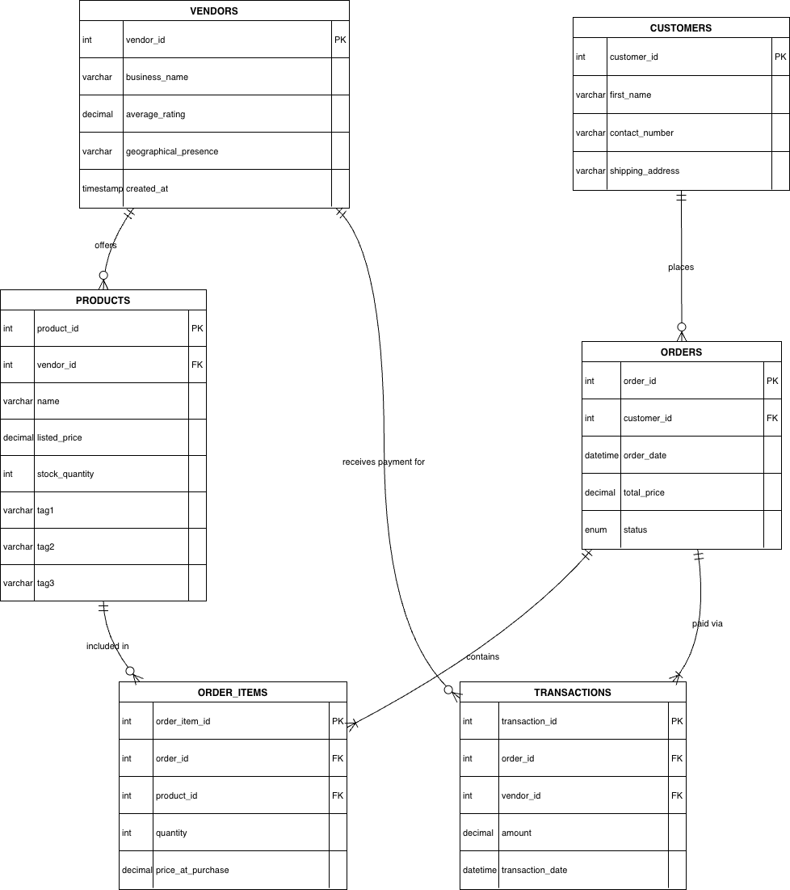
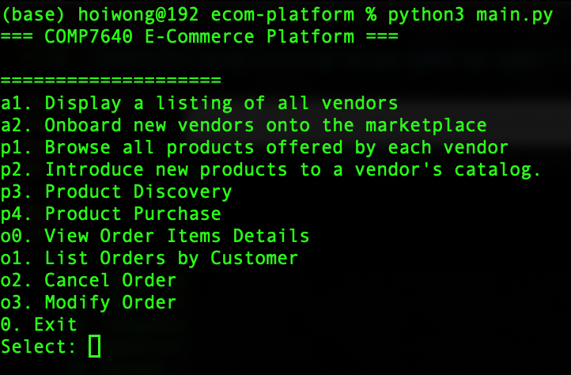

# COMP7640 E-COMMERCE PLATFORM

## Group Member

| ID       | Name        |
|----------|-------------|
| 25447580 | WANG Kai    |
| 25446347 | WANG Qi     |
| 25400991 | CHEN Junlin |
| 25401351 | DI Xinyu    |
| 25409468 | YAN Zibo    |
| 25400878 | YANG Ziqi   |

## ER Diagram, Table Designs, and Normalization

### ERDiagram



### Table Designs

- **Vendors** Table: Uses ```vendor_id``` as the Primary Key. The ```business_name``` is set to ```UNIQUE``` to prevent duplicate registrations. A ```CHECK``` constraint ensures the ```average_rating``` stays between 0.00 and 5.00.
- **Products Table**: Linked to ```vendors``` via ```vendor_id``` (Foreign Key) with ```ON DELETE CASCADE``` to ensure that if a vendor is removed, their inventory is also deleted. It supports up to three tags (```tag1```, ```tag2```, ```tag3```) for product discovery.
- **Customers Table**: Stores buyer identity. ```customer_id``` is the Primary Key.
- **Orders Table**: Tracks order status using an ```ENUM``` type (```PENDING```, ```PROCESSING```, ```SHIPPED```, ```DELIVERED```, ```CANCELLED```). The ```total_price``` is updated based on the items purchased.
- **Order_Items Table**: Captures the state of a product at the time of purchase. It includes ```price_at_purchase``` to preserve historical financial records regardless of future price changes in the ```products``` table.
- **Transactions Table**: Implements the requirement for recording customer-to-vendor payments. It ensures that the ```amount``` paid to each vendor is correctly tracked for every order.

### Normalization and Design Considerations

- **1NF**: all attrs are atomic value. we forbid multi value attr by using separate row for order item and transaction
- **2NF**: Each table has it own primary key, and all non key attrs are fully functionally dependent on the Primary key.
- **3NF**: we make sure there are no transitive dependency. ex. customer shipping detail are store in customer table rather than order to avoid redundancy.

### Data Integrity & Robust

- **Check Constraints**: Applied to ```listed_price```, ```stock_quantity```, and ```total_price``` to prevent negative values, ensuring data reliability.
- **Referential Integrity**: Used ```ON DELETE RESTRICT``` for customer and product deletions in active orders to prevent orphaned records and maintain transaction history.

## README for run code

make sure ur python version is above 3.10.

```bash
# download code from github
git clone git@github.com:ava1anch33/ecom-platform.git
# go to the file
cd ecom-platform
# download all needed package
pip3 install -r requirements.txt
# check package are already download
pip3 list
# run project
python3 main.py
```

you will see following GUI on your cli:
